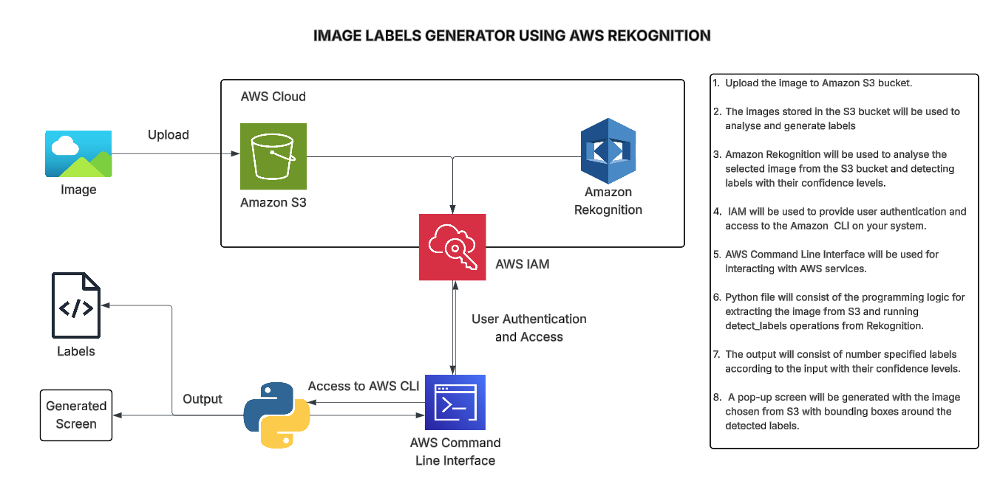
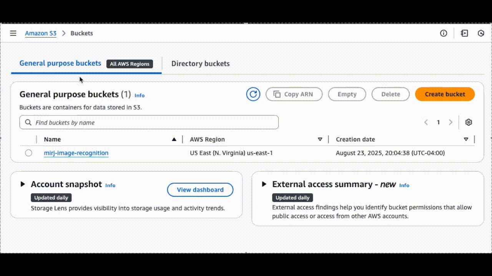
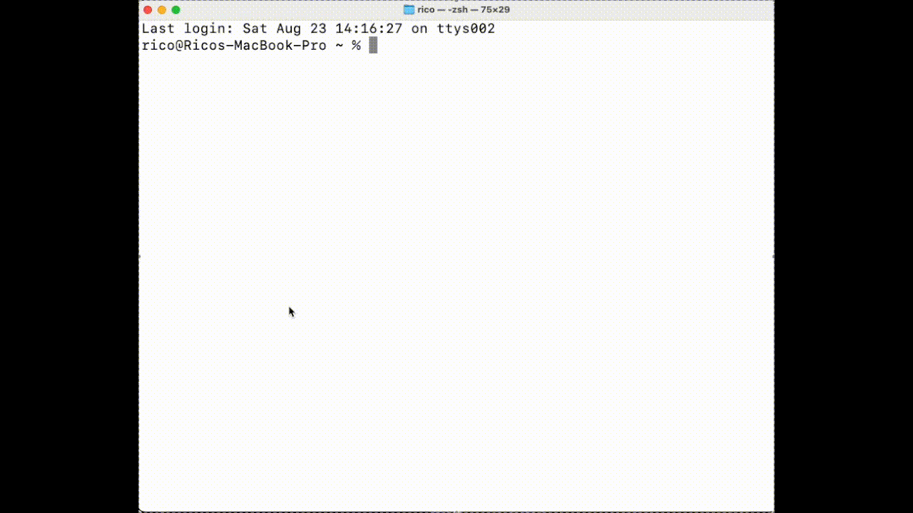
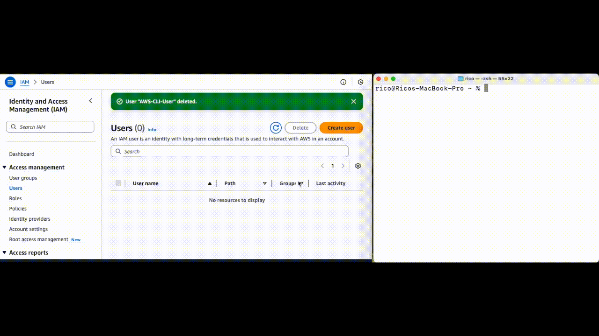
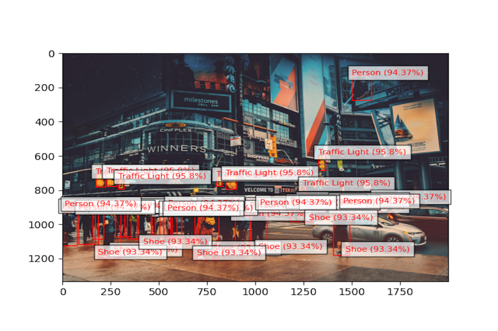

# Image Recognition System

## Overview of Project ☁️

In this project, we will be building an image labels generator, using Amazon Rekognition. This is going to be a fun one. Once built, it will be able to recognize and label images. For example, if you have a photo of a cat, Amazon Recognition will be able to identify what it is, and label the image as a cat.

## Steps to be performed 👩‍💻

In the next few lessons, we'll be going through the following steps:

1. Creating an Amazon S3 Bucket
2. Uploading images to the S3 Bucket
3. Installing configuring the AWS Command line interface (CLI)
4. Importing libraries
5. Adding detect_labels function
6. Adding main function
7. Running your python file

## Services Used 🛠

- **Amazon S3**: For storing the images in the process of generating labels.
- **Amazon Rekognition**: To analyse images and generate image labels.
- **AWS CLI**: Interacting with AWS services through command line interface(CLI).

## Estimated Time & Cost ⚙️

- This project is estimated to take about 20-30 minutes
- Cost: Free (When using the AWS Free Tier)

## ➡️ Diagram



## Create an Amazon S3 Bucket

1. Log in to your **AWS Management Console**.
2. Navigate to the Amazon S3 service from the search bar. An S3 bucket is like a virtual storage box in the cloud where you can keep your files safe and easily accessible with permissions.
3. Click on '**Create Bucket**'.
4. Choose a unique name for your bucket and select the region the want the storage bucket.
5. Leave the default settings for the rest of the options and click '**Create Bucket**'.
6. We will use this bucket to store the images on which labels are to be generated. Let's go ahead and upload some images in the S3 bucket.


## Upload Images to S3 Bucket

1. Once the bucket is created, navigate to the bucket.
2. Click on the 'Upload' button and select the images you want to analyse from your system.
3. Click on Upload. Your image has now been uploaded in the S3 bucket.
4. We will use these images for labelling so try to upload some images that have multiple objects present to see the accuracy of the model when multiple labels are present. For example: A busy city street.



## Installing the AWS Command line interface(CLI)

The AWS CLI is used to interact with various AWS services from the command line. To install AWS CLI:

1. Open your terminal or command prompt.
2. Run the command appropriate for your operating system to install the AWS CLI.

```bash
# For Windows:
msiexec.exe /i https://awscli.amazonaws.com/AWSCLIV2.msi
```

```bash
# For macOS (using Homebrew):
brew install awscli
```

```bash
# For Linux (using package manager):
sudo apt-get install awscli
```

To check if the AWS CLI (Command Line Interface) was installed successfully on your system, you can run the following command in your terminal or command prompt:

```bash
aws --version
```



**Note:** Restart your terminal if it is giving not installed error

You have successfully installed the CLI. Next, we need to configure the CLI with the appropriate user keys to get started with using AWS services.

## Configure AWS CLI

1. To configure your AWS CLI, run the following command in your terminal:

```bash
aws configure
```

2. Running this command will ask for a access key and secret access key.

**What are these?**
To access your AWS account from CLI, you need to set up a user account associated with it and these keys are used for the authentication for accessing the AWS services.

3. Login to your **AWS Management console** and search for **IAM** in the search bar.
4. Navigate to **Users** and click on **Create User**.
5. Give an appropriate user name and click **Next**.
6. For the Permission options, choose the option '**Attach policies directly**' and attach the '_AdministratorAccess_' policy.

   (Be careful while using the Administrator Access policy as we get the full access to the AWS services and is generally not recommended if the user will be accessed by someone else).

7. Click on Next and Create User.
8. Navigate to the user you created, and click on create Access key under the Access Keys option.
9. Choose the **Command Line Interface(CLI)** as the use case, check the confirmation box and click **Next**.
10. Provide a suitable description about purpose of the Access key and Create Access Key.
11. You will be provided with an **Access key** and a **Secret Access Key**. These keys can be used to access your AWS services so make sure these are kept confidential.
12. Some best practices while using Access Keys:
    - Never store your access key in plain text, in a code repository, or in code.
    - Disable or delete access key when no longer needed.
    - Enable least-privilege permissions.
    - Rotate access keys regularly.
13. Go back to your terminal or command prompt and paste the keys that you just generated.
14. Choose the region (Make sure the CLI default region and the S3 bucket region are the same)
15. The general flow of the command line would look like:

```bash
PS H:\AWS-beginner-friendly-projects\Image label> aws configure
AWS Access Key ID [****************L4TV]: ****************
AWS Secret Access Key [****************mtjR]: *******************
Default region name [us-east-1]: us-east-1
Default output format [None]: None
```

**Note:** The Access ID and Access Secret Key in the video below are already disabled you cannot use it for demo purpose only.



We have configured our AWS CLI. For our next steps, we will write the python code for extracting pictures from S3 bucket and applying detect_labels operation from Rekognition to generate the labels with their confidence score.

## Importing Libraries

1. Open your preferred IDE (VSCode etc.) and create a .py file for performing your coding.
2. Open a terminal and install the libraries needed for this project.

```bash
pip3 install boto3
pip3 install matplotlib
```

3. Let's import the necessary libraries. We need:

   - **boto3** for interacting with AWS services.
   - **matplotlib** for visualization.
   - **PIL (Python Imaging Library)** for handling image data.
   - **BytesIO** from the io module to work with image data.

4. Add the below code in your .py file.


## Define Functions

### detect_labels function

Now, let's define a function called **detect_labels**. This function takes a photo and bucket name as input parameters. Within the function:

- We create a **Rekognition** client using boto3.
- We use the **detect_labels** method of the Rekognition client to detect labels in the given photo.
- We print the detected labels along with their confidence levels.
- We load the image from the **S3 bucket** using boto3 and PIL.
- We use **matplotlib** to display the image and draw bounding boxes around the detected objects.


### main function


### Running your Python file

1. Open the terminal in the directory where your Python file is present and run the command:

2. You will get an output with 10 detected labels and their confidence levels and a pop-up screen displaying the image that was uploaded on your S3 bucket with the bounding boxes present on the generated labels.


## ➡️ Final Result

### Before


### After


